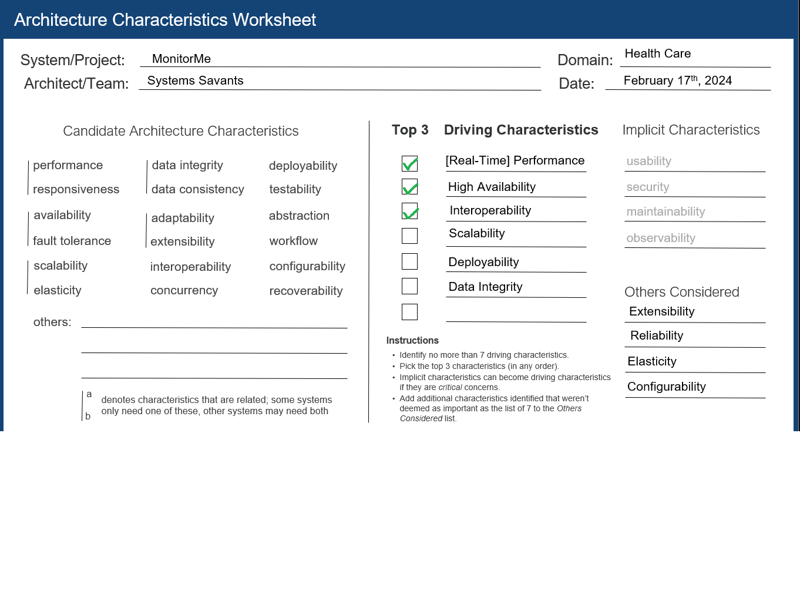

[> Home](../README.md)  |  [> Architecture Analysis Dir](README.md) |  [< Prev](3.3.ActorsActionsComponents.md)  |  [Next >](3.5.CapacityPlanning.md)

---

## 3.4 Key Architecture Characteristics

By identifying the key architecture characteristics (capabilities) for this solution we can then identify the toward which *architecture style we are push toward* hence our *best* solution. Best practice is to identify seven or less architecture characteristics (capabilities). These, along with the implicit architecture characteristics, will then feed into the overall architecture of the MonitorMe system.

### Candidate Architecture Characteristics

performance    responsiveness    availability    fault-tolerance    scalability/elasticity    data integrity    data consistency    adaptability    extensibility    interoperability    concurrency    deployability    testability    abstraction    workflow    configurability    recoverability    reliability    authorisation    agility    cost    domain-partitioning    evolvability    integration

### Selected Architecture Characteristics

| Top 3 | Characteristic               | Source                                                       |
| ----- | ---------------------------- | ------------------------------------------------------------ |
| Y     | Interoperability/Integration | Integration of patient's vital sign devices with MonitorMe (analyzing streaming data), and with MyMedicalData. |
|       | Data Integrity               | Vital sign data analyzed and recorded through MonitorMe must be as accurate as possible as the human lives are at stake. |
|       | Scalability/Elasticity       | StayHealthy, Inc. is looking towards adding more vital sign monitoring devices for MonitorMe in the future. |
| Y     | [Real-Time] Performance      | Vital signs data is send to consolidated monitoring screen with an average response time of 1 second or less. |
| Y     | High Availability            | System needs to be available all the times as the medical professional need to monitor patients vitals and take decision based on them. |
|       | Deployability                | We are proposing a micro service architecture with a service for each device ,being able to deploy the whole system seemlessly is important. |

### Implicit Architecture Characteristics

The following are a bedrock of architecture characteristics. They may not affect the *structure* but will feed into the overall architecture.

- Usability
- Security, authentication and authorization
- Maintainability
- Simplicity or observability

Note that Configurability was considered for patients.

---
[> Home](../README.md)  |  [> Architecture Analysis Dir](README.md) |  [< Prev](3.3.ActorsActionsComponents.md)  |  [Next >](3.5.CapacityPlanning.md)
