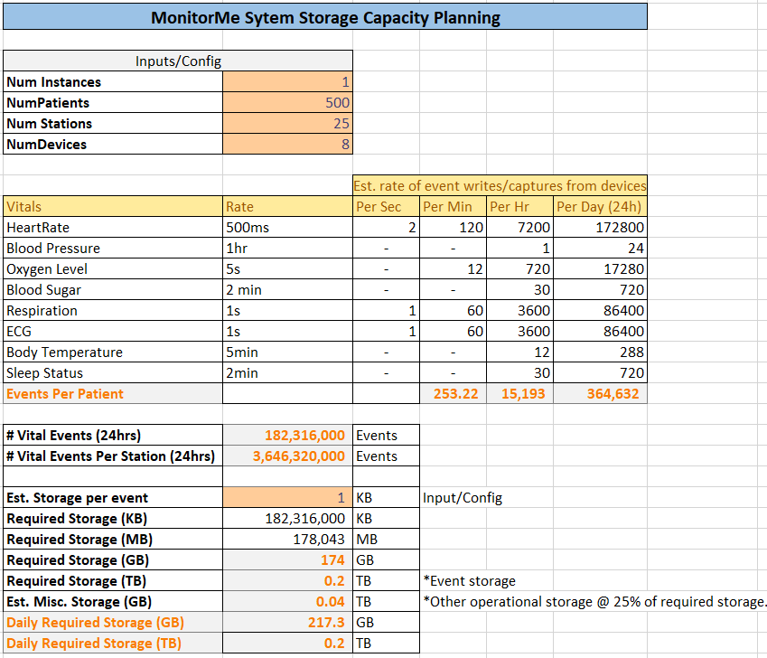

[> Home](../README.md)  |  [> Architecture Analysis Dir](README.md) |  [< Prev](3.4.KeyArchitectureCharacteristics.md)  |  [Next >](3.6.DataStore.md)

---

## Capacity Planning

Event creation rates from the requirements were used to plan for hourly and daily capacity needs. Based on daily capacity needs (needed for uploading 24 hour patient snapshot data), the most immediately needed data would be located in a indexed/partitioned set or in a hot-tier.

Data accessed from an archive would go into a cold or passive storage medium i.e. after data retention periods are set. For now, these are not accounted for as part of assumptions.

---
[> Home](../README.md)  |  [> Architecture Analysis Dir](README.md) |  [< Prev](3.4.KeyArchitectureCharacteristics.md)  |  [Next >](3.6.DataStore.md)
