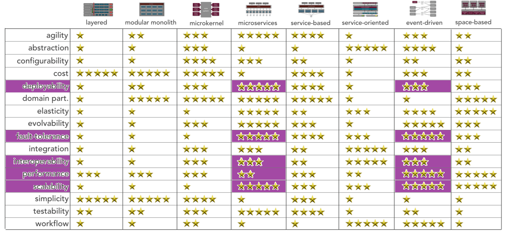

[> Home](../README.md)  |  [> Architecture Analysis Dir](README.md) |  [< Prev](3.6.DataStore.md)  |  [Next >](/4.%20Architecture%20Decision%20Records/README.md)

---

# 3.7 Architecture Style Analysis & Selection

The [key architectural characteristics](../1.ProblemBackground/ArchitectureAnalysis.md) that were identified help us to select and overall architecture style. The top three are shown in bold and with a ^.

- **Interoperability ^** 
- Data Integrity
- Scalability/Elasticity
- **[Real-Time] Performance ^**
- **High Availability ^**
- Deployability

## Architecture Capabilities Comparison

The above characteristics are highlighted below in green, with data integrity, above, not included in the matrix below. Data integrity will be a key architecture characteristic of the [data store selected](DataStore.md), along with the interface to this data store.

[original comparison matrix from [DeveloperToArchitect.com](https://www.developertoarchitect.com/downloads/worksheets.html)]

## Architecture Capabilities Analysis

The above matrix gives us two candidates for our architecture, which need further analysis:

### Microservices

| Pros                                                         | Cons                                                         | Mitigations                                                  |
| ------------------------------------------------------------ | ------------------------------------------------------------ | ------------------------------------------------------------ |
| Scores highly on elasticity and scalability, very important for analyzer computation and data access. | Scores low on configurability and workflow, which are not any of our top 3 characteristics. | Configurability is a concern, scoring low, but it is configurability of the patient that is important and not of the system as a whole. |
| Scores highly on fault-tolerance, important to make sure MonitorMe is not disrupted by a fault in one area. | Middling score on interoperability/integration, important because of integration with patient vital sign devices and MyMedicalData. | The middling interoperability ability can be mitigated by using an interface for integration with patient vital sign devices and MyMedicalData. |
|                                                              | Requires that the database be split along with each microservice. This would be very complex and another big trade-off. |                                                              |
|                                                              | Scores low on workflow, which would be a trade-off with workflow being important for onboarding of customers. |                                                              |
|                                                              | Also scores badly on cost and simplicity. Not key characteristics, but likely to be important to management and lead technologists respectively. |                                                              |

### Event-Driven

| Pros                                                         | Cons                                                         | Mitigations                                                  |
| ------------------------------------------------------------ | ------------------------------------------------------------ | ------------------------------------------------------------ |
| Scores highly on elasticity and scalability, very important for analyzer computation and data access. | Interoperability and configurability score fairly low, which is a concern with interoperability being two of the top three characteristics. | Configurability is a concern, scoring low, but it is configurability of the patient that is important and not of the system as a whole. |
| Scores highly on fault-tolerance, important to make sure MonitorMe is not disrupted by a fault in one area. | Middling score on interoperability/integration, important because of integration with patient vital sign devices and MyMedicalData. | The middling interoperability ability can be mitigated by using an interface for integration with patient vital sign devices and MyMedicalData. |
| Workflow scores highly, important for onboarding of patients. | scores badly on simplicity. Not a key characteristic, but likely to be important to lead technologists. |                                                              |

## Conclusion

Both architecture options have trade-offs, so we decided to go with a commbination of both microservices and event driven.

---
[> Home](../README.md)  |  [> Architecture Analysis Dir](README.md) |  [< Prev](3.6.DataStore.md)  |  [Next >](/4.%20Architecture%20Decision%20Records/README.md)
