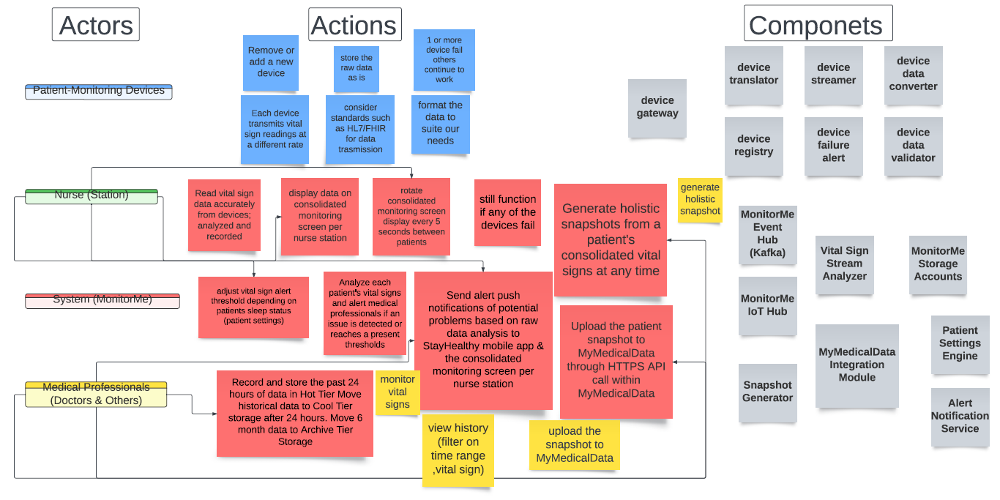
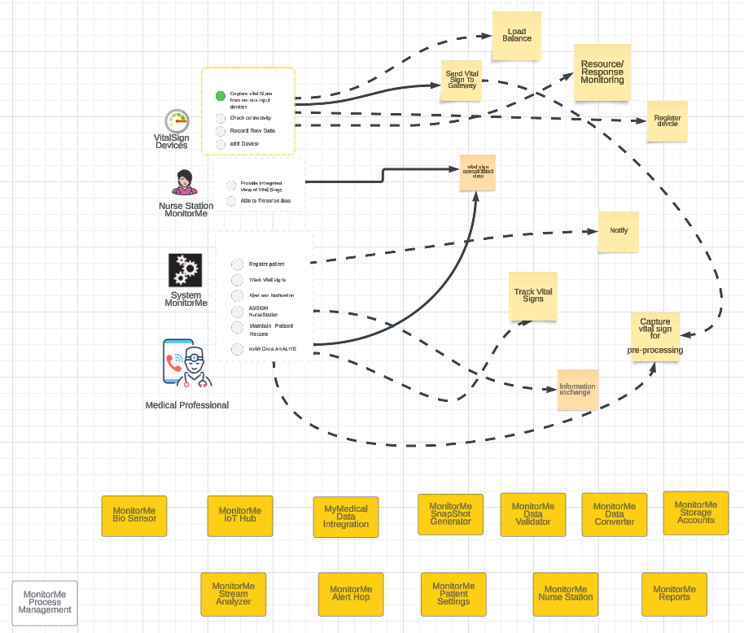
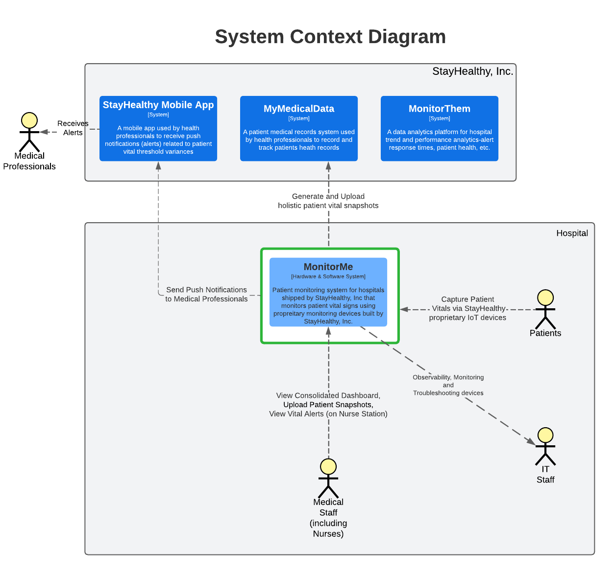
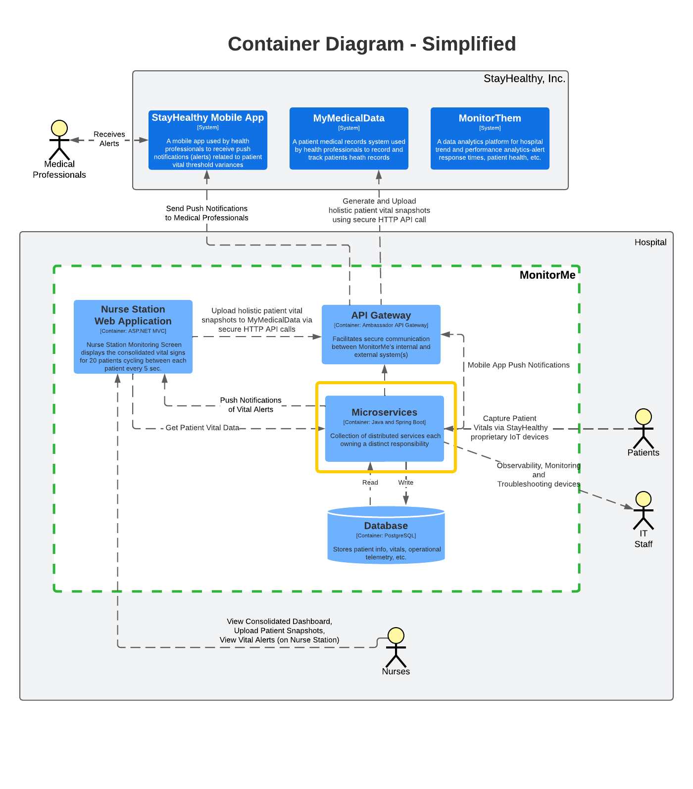
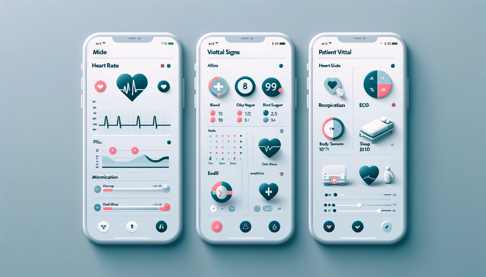

# Architectural Katas Winter 2024 - Systems Savants

<!--  **1st Place Winners of the O'Reilly Architecture Katas Winter 2024** -->

> This documentation repository is hosted on GitHub here: [https://github.com/systems-savants/monitor-me](https://github.com/systems-savants/monitor-me)

Welcome to our entry for the the O'Reilly Winter 2024 Architectural Katas. We, the System Savants team, are a team of engineers from the health insurance and health services sector. With common objectives of learning and having fun, the team embarked on journey to create a solution for the stated problem. The aim of this documentation git repository is to communicate our design for the problem described for technical and non-technical team audiences alike.

Here's our [five-minute video presentation](https://www.linkedin.com/in/vishalgamji/) for the O'Reilly Architectural Kata.


## Members
- Gibran Castillo [[LinkedIn](https://www.linkedin.com/in/gibran-castillo/)]
- Vishal Gamji [[LinkedIn](https://www.linkedin.com/in/vishalgamji/)]
- Subodh Gupta [[LinkedIn](https://www.linkedin.com/in/pending/)]
- Harshada Kandalgaonkar [[LinkedIn](https://www.linkedin.com/in/harshada-kandalgaonkar/)]


## Table of Contents 
```
1. Problem Background
  1.1 StayHealthy Inc. and MonitorMe
  1.2 Functional Requirements
  1.3 Glossary 
2. Problem Analysis
  2.1 Business Goals & Business Drivers
  2.2 Engagement Model
  2.3 Other Considerations
3. Architecture Analysis
  3.1 Architecturally Significant Requirements
  3.2 Constraints and Assumptions
  3.3 Actors, Actions, and Components
  3.4 Key Architecture Characteristics
  3.5 Capacity Planning
  3.6 Data Storage Considerations
  3.7 Guiding (Architecture) Principles
  3.8 Architecture Style Selection
4. Architecture Decision Records (ADRs)
  001-Use-K8s-with-containerize-microservice-architecture-style
  002-Use-API-Gateway-in-self-hosted-mode
  003-Hosting-Platform-On-Prem
  004-System-Design-Approach
  005-Telemetry-Observability-with-Elastic
  006-Layered-approach-to-security
  007-Deployment-Strategy
  008-Use-of-Infrastructure-as-Code-(IaC)
  009-IoT-Device-Communication-MQTT-Protocol
  010-Interoperability
  011-Postgre-SQL-for-Data-Storage
5. Solution Overview
  5.1 High-Level Architecture
  5.2 Deployment Architecture
  5.3 Nurse Station Dashboard UI View
  5.4 Medical Professional Mobile APP UI View

```

## Solution Highlights

[1. Problem Background](1.%20Problem%20Background/README.md)

[2. Problem Analysis](2.%20Problem%20Analysis/README.md)

[3. Architecture Analysis](3.%20Architecture%20Analysis/README.md)


Actors, Actions, and Components

**First Draft**




**Final Version**




#### Selected Architecture Characteristics

| Top 3 | Driving Characteristics      | Source                                                       |
| ----- | ---------------------------- | ------------------------------------------------------------ |
| Y     | Interoperability/Integration | Integration of patient's vital sign devices with MonitorMe (analyzing streaming data), and with MyMedicalData. |
|       | Data Integrity               | Vital sign data analyzed and recorded through MonitorMe must be as accurate as possible as the human lives are at stake. |
|       | Scalability/Elasticity       | StayHealthy, Inc. is looking towards adding more vital sign monitoring devices for MonitorMe in the future. |
| Y     | [Real-Time] Performance      | Vital signs data is send to consolidated monitoring screen with an average response time of 1 second or less. |
| Y     | High Availability            | System needs to be available all the times as the medical professional need to monitor patients vitals and take decision based on them. |
|       | Deployability                | We are proposing a micro service architecture with a service for each device ,being able to deploy the whole system seemlessly is important. |

#### Implicit Architecture Characteristics

The following are a bedrock of architecture characteristics. They may not affect the *structure* but will feed into the overall architecture.

- Usability
- Security, authentication and authorization
- Maintainability
- Simplicity or observability


#### Capacity Planning


#### Architecture Style Analysis & Selection

The above characteristics are highlighted below in green, with data integrity, above, not included in the matrix below. Data integrity will be a key architecture characteristic of the [data store selected](DataStore.md), along with the interface to this data store.


*Both Microservices and Event Driven architecture options have trade-offs, so we decided to go with a commbination of both microservices and event driven.*

[4. Architecture Decision Records (ADRs)](/4.%20Architecture%20Decision%20Records/README.md) 

[5. Proposed Solution](3.%20Architecture%20Analysis/README.md) 


### High-Level Architecture Diagram using the C4 Model

**Context Diagram (C1)**


**Container Diagram (C2)**


**(Microservices Expanded) Container Diagram (C2):**


### Deployment Diagram [Hybrid/Private Cloud using On-premises AWS Outposts Servers]


**Nurse Station Dashboard View**


**Medical Professional Mobile App View**



## Resources <a href='#' id='resources'></a>

- [2024 O'Reilly Architecture Katas Presentation](assets/docs/2024_oreilly_architectural_katas.pdf)
- [Team Logo Generation by Dall-E](https://openai.com/dall-e-2)
- [Nurse Dashboard Image Generated by Dall-E](https://openai.com/dall-e-2)
- [Mobile App Image Generated by Dall-E](https://openai.com/dall-e-2)

## References

- [C4 Model](https://c4model.com/)
- [Amazon Web Services Outposts - Servers](https://aws.amazon.com/outposts/servers/?nc=sn&loc=3)
- [Ambassador API Gateway](https://www.getambassador.io/)
- [HiveMQ - MQTT Broker](https://www.hivemq.com/info/mqtt-broker)


---
