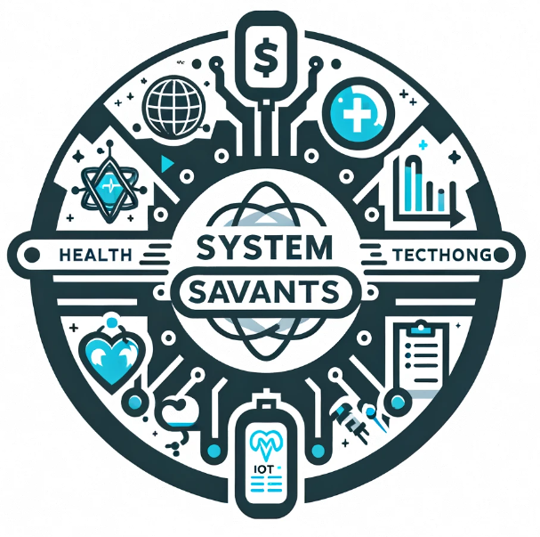

# Architectural Katas Winter 2024 - Systems Savants

<!--  **1st Place Winners of the O'Reilly Architecture Katas Winter 2024** -->

> This documentation repository is hosted on GitHub here: [https://github.com/systems-savants/monitor-me](https://github.com/systems-savants/monitor-me)

Welcome to the System Savant's entry to the O'Reilly Winter 2024 Architectural Katas. We, the System Savants group, are a team of engineers from the health insurance and health services sector. With common objectives of learning and having fun, the team embarked on journey to create a solution for the stated problem. The aim of this documentation git repository is to communicate our design for the problem described for technical and non-technical team audiences alike.

## Members
- Gibran Castillo [[LinkedIn](https://www.linkedin.com/in/gibran-castillo/)]
- Vishal Gamji [[LinkedIn](https://www.linkedin.com/in/vishalgamji/)]
- Harshada Kandalgaonkar [[LinkedIn](https://www.linkedin.com/in/harshada-kandalgaonkar/)]
- Subodh Gupta [[LinkedIn](https://www.linkedin.com/in/pending/)]

## Solution Structure

[Problem Background](1.ProblemBackground/README.md)

- [Business Goals, Drivers & Requirements](1.ProblemBackground/BusinessGoalsDriversAndRequirements.md)
- [Stakeholder Concerns](1.ProblemBackground/StakeholderConcerns.md)
- [Architecture Analysis](1.ProblemBackground/ArchitectureAnalysis.md)
- [Actors, Actions & Components](1.ProblemBackground/ActorsActionsAndComponents.md)
- [Constraints & Assumptions](1.ProblemBackground/ConstraintsAndAssumptions.md)
- [RAID Log](1.ProblemBackground/RAID.md)

[Solution Background](2.SolutionBackground/README.md)

- [Architecture Principles](2.SolutionBackground/ArchitecturePrinciples.md)
- [Overall Architecture Style Analysis](2.SolutionBackground/ArchitecturePatterns.md)
- [Conceptual System Design](2.SolutionBackground/Conceptual.md)
- [Data Store Solution](2.SolutionBackground/DataStore.md)
- [Security](2.SolutionBackground/Security.md)
- [Deployment](2.SolutionBackground/Deployment.md)
- [ADRs](4.ADRs/README.md)

[Views & Perspectives](3.ViewsAndPerspectives/README.md)

- [C4 Models](3.ViewsAndPerspectives/C4Models/README.md)

## Resources 

- [2024 O'Reilly Architecture Katas Presentation](assets/docs/2024_oreilly_architectural_katas.pdf)
- [Carelon Architectural Katas Winter 2024](assets/docs/Architectual-Katas-Winter-2024.pdf)
- [Team Logo Generation by Dall-E](https://openai.com/dall-e-2)
- [Nurse Dashboard Image Generated by Dall-E](https://openai.com/dall-e-2)
- [Mobile App Image Generated by Dall-E](https://openai.com/dall-e-2)

## References

- [C4 Model](https://c4model.com/)
- [Amazon Web Services Outposts - Servers](https://aws.amazon.com/outposts/servers/?nc=sn&loc=3)
- [Ambassador API Gateway](https://www.getambassador.io/)
- [HiveMQ - MQTT Broker](https://www.hivemq.com/info/mqtt-broker)

---
